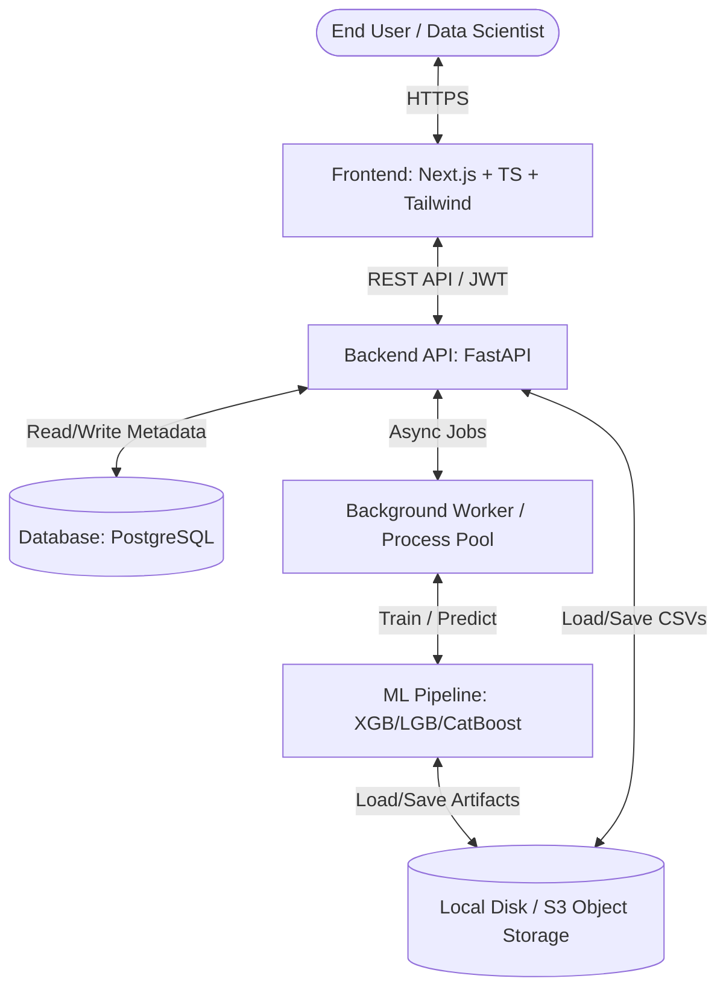
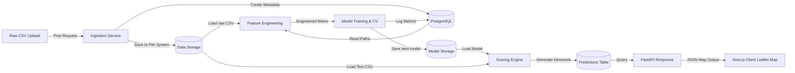
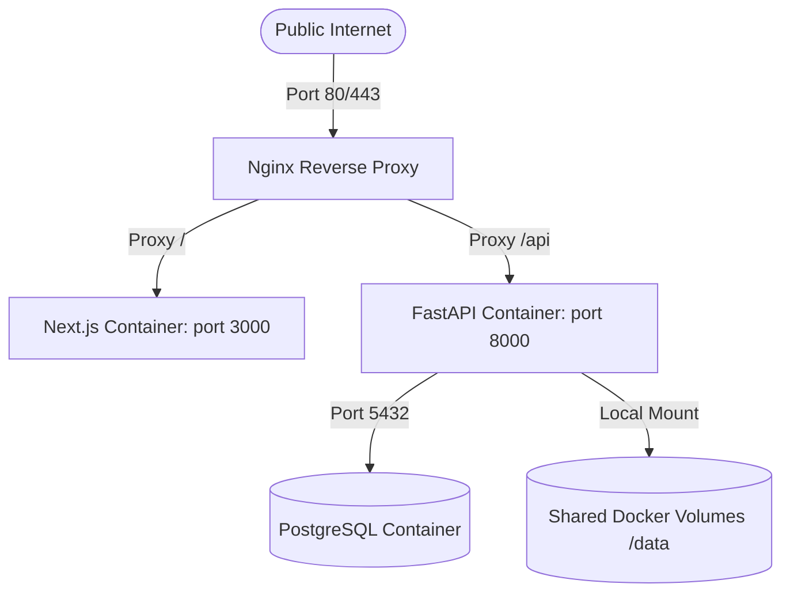

# System Architecture Document (ARCHITECTURE.md)
## Project: Enterprise AI Traffic Demand Prediction System

### Document Control
* **Version**: 1.0.0
* **Date**: June 2, 2026
* **Status**: Approved

---

## 1. High-Level Architecture

The system follows a classic **3-Tier Architecture** decoupled for enterprise scalability, featuring a containerized frontend, backend, and background machine learning pipeline:



---

## 2. Component Diagram

The internal components of the system interact through clearly defined interfaces. The backend FastAPI orchestrates authentication, DB queries, and delegates compute-heavy operations to the ML runner.

```mermaid
graph TB
    subgraph Client Tier (Next.js)
        AuthUI[Auth Pages]
        DashUI[Analytics Dashboard]
        MapUI[Interactive Traffic Map]
        MLUI[Training & Evaluation Center]
    end

    subgraph Service Tier (FastAPI)
        AuthCtrl[Auth Controller & JWT]
        DataCtrl[Dataset Ingestion Manager]
        ModelCtrl[Model Lifecycle Controller]
        PredCtrl[Prediction & XAI Engine]
    end

    subgraph Core ML Engine (Scikit-Learn / Boosting)
        FeatEng[Feature Engineering Module]
        Trainer[Model Trainer & CV]
        Evaluator[Metric Scorer]
        Explainer[SHAP Explainer]
    end

    subgraph Data & Storage Tier
        Postgres[(PostgreSQL DB)]
        ModelStore[(Disk Model Store)]
        CSVStore[(Disk CSV Ingest)]
    end

    Client_to_Auth[Auth UI] -->|REST| AuthCtrl
    Client_to_Dash[Dash UI] -->|REST| PredCtrl
    Client_to_Map[Map UI] -->|REST| PredCtrl
    Client_to_ML[ML UI] -->|REST| ModelCtrl
    
    AuthCtrl --> Postgres
    DataCtrl --> CSVStore
    ModelCtrl --> Trainer
    ModelCtrl --> Postgres
    PredCtrl --> Explainer
    PredCtrl --> Postgres
    
    Trainer --> FeatEng
    Trainer --> Evaluator
    Trainer --> ModelStore
    Explainer --> ModelStore
```

---

## 3. Data Flow Diagram

The diagram below maps the path of a raw CSV dataset from initial upload to model training, prediction generation, and final UI rendering.



---

## 4. Deployment Architecture (Dockerized)

The platform is deployed using container orchestration. Nginx handles SSL termination and reverse proxies requests to the appropriate service.



---

## 5. Security Architecture

To ensure enterprise-grade security, the following controls are implemented:
* **Authentication**: Token-based authentication using **JSON Web Tokens (JWT)** signed with a HMAC-SHA256 algorithm.
* **Authorization**: Role-Based Access Control (RBAC) defining access permissions for `Viewer`, `Analyst`, `Data Scientist`, and `Administrator`.
* **Data Protection**:
  * Passwords hashed using `bcrypt` (minimum work factor 12).
  * Environment variables store all secret credentials (secret keys, DB passwords).
  * CORS headers configured to only allow requests from whitelisted frontend origins.
* **Audit Trails**: Recording user actions (logins, dataset imports, model training, deletion events) into the `audit_logs` table for compliance.

---

## 6. API Architecture

The API follows RESTful design patterns:
* **Versioned Paths**: `/api/v1/...`
* **JSON Communication**: All request and response bodies use standard JSON formatting, except for dataset uploads (multipart/form-data) and prediction downloads (text/csv).
* **Dependency Injection**: FastAPI dependencies handle token validation, user authentication, and database session lifecycles (`db_session`).
