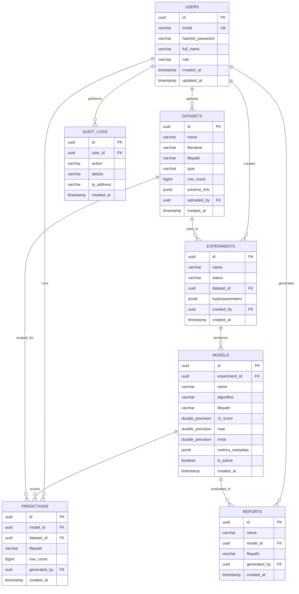

# Database Design Document (DATABASE.md)
## Project: Enterprise AI Traffic Demand Prediction System

### Document Control
* **Version**: 1.0.0
* **Date**: June 2, 2026
* **Status**: Approved

---

## 1. Entity Relationship (ER) Diagram

The diagram below outlines the core entities and their relationships. A user uploads datasets, runs machine learning experiments, creates models, generates prediction outputs, compiles analytics reports, and registers audit trails.



---

## 2. Table Definitions

### 2.1 Table: `users`
Stores user authentication details, profiles, and access control roles.
* `id`: UUID (Primary Key) - unique identifier for the user.
* `email`: VARCHAR(255) (Unique, Not Null) - login identifier.
* `hashed_password`: VARCHAR(255) (Not Null) - bcrypt hashed password.
* `full_name`: VARCHAR(255) (Not Null) - user's display name.
* `role`: VARCHAR(50) (Not Null) - role for RBAC (`admin`, `data_scientist`, `analyst`, `viewer`).
* `created_at`: TIMESTAMP (Not Null) - registration timestamp.
* `updated_at`: TIMESTAMP (Not Null) - last modification timestamp.

### 2.2 Table: `datasets`
Tracks metadata and storage filepaths for raw and processed CSV datasets.
* `id`: UUID (Primary Key).
* `name`: VARCHAR(255) (Not Null) - dataset name.
* `filename`: VARCHAR(255) (Not Null) - original filename.
* `filepath`: VARCHAR(1024) (Not Null) - path on local/cloud storage.
* `type`: VARCHAR(50) (Not Null) - dataset category (`train` or `test`).
* `row_count`: BIGINT (Not Null) - total rows.
* `schema_info`: JSONB (Nullable) - schema structure, column types, and data summaries.
* `uploaded_by`: UUID (Foreign Key linking to `users.id` on delete set null).
* `created_at`: TIMESTAMP.

### 2.3 Table: `experiments`
Represents an AutoML training job configured by a user.
* `id`: UUID (Primary Key).
* `name`: VARCHAR(255) (Not Null) - name of the run.
* `status`: VARCHAR(50) (Not Null) - current execution state (`running`, `completed`, `failed`).
* `dataset_id`: UUID (Foreign Key linking to `datasets.id` on delete cascade).
* `hyperparameters`: JSONB (Nullable) - training config parameters.
* `created_by`: UUID (Foreign Key linking to `users.id` on delete set null).
* `created_at`: TIMESTAMP.

### 2.4 Table: `models`
Maintains records of trained model weights, evaluation metrics, and active states.
* `id`: UUID (Primary Key).
* `experiment_id`: UUID (Foreign Key linking to `experiments.id` on delete cascade).
* `name`: VARCHAR(255) (Not Null) - model descriptor.
* `algorithm`: VARCHAR(100) (Not Null) - ML algorithm used (`XGBoost`, `LightGBM`, etc.).
* `filepath`: VARCHAR(1024) (Not Null) - storage path for the weights/pipeline.
* `r2_score`: DOUBLE PRECISION - Out-of-fold coefficient of determination.
* `mae`: DOUBLE PRECISION - Out-of-fold Mean Absolute Error.
* `rmse`: DOUBLE PRECISION - Out-of-fold Root Mean Squared Error.
* `metrics_metadata`: JSONB - validation fold metrics.
* `is_active`: BOOLEAN (Default: False) - indicates if model is the current champion.
* `created_at`: TIMESTAMP.

### 2.5 Table: `predictions`
Tracks generated traffic demand predictions for historical reference and downloads.
* `id`: UUID (Primary Key).
* `model_id`: UUID (Foreign Key linking to `models.id` on delete cascade).
* `dataset_id`: UUID (Foreign Key linking to `datasets.id` on delete cascade) - the target test set.
* `filepath`: VARCHAR(1024) (Not Null) - output CSV prediction file path.
* `row_count`: BIGINT (Not Null) - count of scored entries.
* `generated_by`: UUID (Foreign Key linking to `users.id` on delete set null).
* `created_at`: TIMESTAMP.

### 2.6 Table: `reports`
Maintains analytics, performance, and explainability reports.
* `id`: UUID (Primary Key).
* `name`: VARCHAR(255).
* `model_id`: UUID (Foreign Key linking to `models.id` on delete cascade).
* `filepath`: VARCHAR(1024) (Not Null) - location of report document.
* `generated_by`: UUID (Foreign Key linking to `users.id`).
* `created_at`: TIMESTAMP.

### 2.7 Table: `audit_logs`
Logs critical user operations for security and compliance audits.
* `id`: UUID (Primary Key).
* `user_id`: UUID (Foreign Key linking to `users.id` on delete set null).
* `action`: VARCHAR(255) (Not Null) - description of action.
* `details`: VARCHAR(2048) - JSON format detailed description of action state changes.
* `ip_address`: VARCHAR(45) - user IP client.
* `created_at`: TIMESTAMP.

---

## 3. SQL Initialization Script

Below is the complete DDL script to construct the PostgreSQL database schema.

```sql
-- Enable UUID extension
CREATE EXTENSION IF NOT EXISTS "uuid-ossp";

-- Table: Users
CREATE TABLE IF NOT EXISTS users (
    id UUID PRIMARY KEY DEFAULT uuid_generate_v4(),
    email VARCHAR(255) UNIQUE NOT NULL,
    hashed_password VARCHAR(255) NOT NULL,
    full_name VARCHAR(255) NOT NULL,
    role VARCHAR(50) NOT NULL CHECK (role IN ('admin', 'data_scientist', 'analyst', 'viewer')),
    created_at TIMESTAMP WITH TIME ZONE DEFAULT CURRENT_TIMESTAMP,
    updated_at TIMESTAMP WITH TIME ZONE DEFAULT CURRENT_TIMESTAMP
);

-- Table: Datasets
CREATE TABLE IF NOT EXISTS datasets (
    id UUID PRIMARY KEY DEFAULT uuid_generate_v4(),
    name VARCHAR(255) NOT NULL,
    filename VARCHAR(255) NOT NULL,
    filepath VARCHAR(1024) NOT NULL,
    type VARCHAR(50) NOT NULL CHECK (type IN ('train', 'test')),
    row_count BIGINT NOT NULL,
    schema_info JSONB,
    uploaded_by UUID REFERENCES users(id) ON DELETE SET NULL,
    created_at TIMESTAMP WITH TIME ZONE DEFAULT CURRENT_TIMESTAMP
);

-- Table: Experiments
CREATE TABLE IF NOT EXISTS experiments (
    id UUID PRIMARY KEY DEFAULT uuid_generate_v4(),
    name VARCHAR(255) NOT NULL,
    status VARCHAR(50) NOT NULL CHECK (status IN ('pending', 'running', 'completed', 'failed')),
    dataset_id UUID REFERENCES datasets(id) ON DELETE CASCADE,
    hyperparameters JSONB,
    created_by UUID REFERENCES users(id) ON DELETE SET NULL,
    created_at TIMESTAMP WITH TIME ZONE DEFAULT CURRENT_TIMESTAMP
);

-- Table: Models
CREATE TABLE IF NOT EXISTS models (
    id UUID PRIMARY KEY DEFAULT uuid_generate_v4(),
    experiment_id UUID REFERENCES experiments(id) ON DELETE CASCADE,
    name VARCHAR(255) NOT NULL,
    algorithm VARCHAR(100) NOT NULL,
    filepath VARCHAR(1024) NOT NULL,
    r2_score DOUBLE PRECISION NOT NULL,
    mae DOUBLE PRECISION NOT NULL,
    rmse DOUBLE PRECISION NOT NULL,
    metrics_metadata JSONB,
    is_active BOOLEAN NOT NULL DEFAULT FALSE,
    created_at TIMESTAMP WITH TIME ZONE DEFAULT CURRENT_TIMESTAMP
);

-- Table: Predictions
CREATE TABLE IF NOT EXISTS predictions (
    id UUID PRIMARY KEY DEFAULT uuid_generate_v4(),
    model_id UUID REFERENCES models(id) ON DELETE CASCADE,
    dataset_id UUID REFERENCES datasets(id) ON DELETE CASCADE,
    filepath VARCHAR(1024) NOT NULL,
    row_count BIGINT NOT NULL,
    generated_by UUID REFERENCES users(id) ON DELETE SET NULL,
    created_at TIMESTAMP WITH TIME ZONE DEFAULT CURRENT_TIMESTAMP
);

-- Table: Reports
CREATE TABLE IF NOT EXISTS reports (
    id UUID PRIMARY KEY DEFAULT uuid_generate_v4(),
    name VARCHAR(255) NOT NULL,
    model_id UUID REFERENCES models(id) ON DELETE CASCADE,
    filepath VARCHAR(1024) NOT NULL,
    generated_by UUID REFERENCES users(id) ON DELETE SET NULL,
    created_at TIMESTAMP WITH TIME ZONE DEFAULT CURRENT_TIMESTAMP
);

-- Table: Audit Logs
CREATE TABLE IF NOT EXISTS audit_logs (
    id UUID PRIMARY KEY DEFAULT uuid_generate_v4(),
    user_id UUID REFERENCES users(id) ON DELETE SET NULL,
    action VARCHAR(255) NOT NULL,
    details VARCHAR(2048),
    ip_address VARCHAR(45),
    created_at TIMESTAMP WITH TIME ZONE DEFAULT CURRENT_TIMESTAMP
);

-- Create Indexes for optimization
CREATE INDEX IF NOT EXISTS idx_users_email ON users(email);
CREATE INDEX IF NOT EXISTS idx_datasets_uploaded_by ON datasets(uploaded_by);
CREATE INDEX IF NOT EXISTS idx_experiments_dataset_id ON experiments(dataset_id);
CREATE INDEX IF NOT EXISTS idx_models_experiment_id ON models(experiment_id);
CREATE INDEX IF NOT EXISTS idx_models_r2_score ON models(r2_score DESC);
CREATE INDEX IF NOT EXISTS idx_predictions_model_id ON predictions(model_id);
CREATE INDEX IF NOT EXISTS idx_predictions_dataset_id ON predictions(dataset_id);
CREATE INDEX IF NOT EXISTS idx_audit_logs_user_id ON audit_logs(user_id);
CREATE INDEX IF NOT EXISTS idx_audit_logs_created_at ON audit_logs(created_at DESC);
