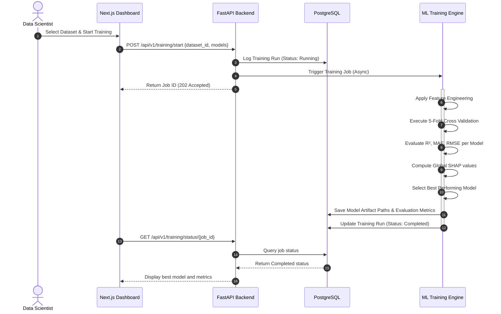
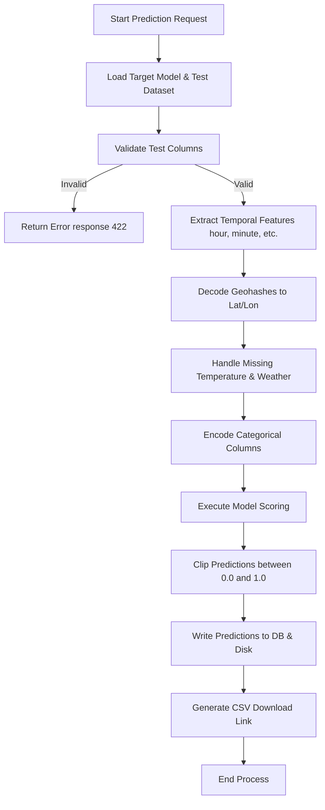

# Functional Requirements Document (FRD)
## Project: Enterprise AI Traffic Demand Prediction System

### Document Control
* **Version**: 1.0.0
* **Date**: June 2, 2026
* **Status**: Approved

---

## 1. Functional Modules Overview

The system consists of 10 primary modules:
1. **Authentication**
2. **Dataset Analysis**
3. **Feature Engineering**
4. **Model Training**
5. **Model Evaluation**
6. **Prediction**
7. **Explainability**
8. **Reporting**
9. **Analytics Dashboard**
10. **Administration**

---

## 2. Module Specifications

### 2.1 Authentication Module
* **Inputs**: Username, Password, Refresh Token.
* **Outputs**: Access Token (JWT), Refresh Token, User Details.
* **Workflow**:
  1. User submits login credentials.
  2. System validates credentials against hash in PostgreSQL.
  3. System generates JWT containing user ID, role, and expiry (15 mins).
  4. User includes JWT in HTTP `Authorization: Bearer <token>` header for subsequent requests.
* **Business Rules**:
  * Passwords must be hashed using bcrypt.
  * Access tokens expire in 15 minutes; refresh tokens expire in 7 days.
* **Validation Rules**:
  * Password must be at least 8 characters, containing one capital letter, one number, and one special character.
* **Error Handling**:
  * 401 Unauthorized for incorrect credentials.
  * 403 Forbidden for expired token.

### 2.2 Dataset Analysis Module
* **Inputs**: Ingested Dataset ID or uploaded raw CSV file.
* **Outputs**: Feature distributions, correlation matrix, missing value counts, and unique value counts.
* **Workflow**:
  1. User uploads raw traffic dataset.
  2. Dataset analysis runner reads the CSV.
  3. Descriptive statistical summary is generated for numerical columns.
  4. Missing values per column are calculated.
* **Business Rules**:
  * The dataset must contain `geohash`, `day`, and `timestamp` fields.
  * The `demand` column must be checked for target availability.
* **Validation & Error Handling**:
  * If columns are missing, return 422 Unprocessable Entity with list of missing headers.

### 2.3 Feature Engineering Module
* **Inputs**: Cleaned dataframe from the dataset module.
* **Outputs**: Engineered feature matrix ready for ML training.
* **Workflow**:
  1. Decode geohashes to `latitude` and `longitude` float values.
  2. Extract temporal features: `hour`, `minute`, and `minute_of_day`.
  3. Apply label encoding or one-hot encoding to categorical features (`Weather`, `LargeVehicles`, `Landmarks`, `RoadType`).
  4. Create spatial aggregations (e.g. mean traffic demand per geohash zone).
* **Business/Validation Rules**:
  * Geohash decoding must map latitude between -90 and +90, and longitude between -180 and +180.
  * Imputation of missing weather values uses forward/backward temporal fill grouped by geohash, or global mode if a geohash has no historical logs.

### 2.4 Model Training Module
* **Inputs**: Dataset ID, split ratio, model types list.
* **Outputs**: Model artifacts (pickle/joblib files), run parameters, training logs.
* **Workflow**:
  1. Load processed training feature matrix.
  2. Split data into train and validation sets using K-Fold cross validation.
  3. Train chosen models (Linear, RF, XGB, LGBM, CatBoost) sequentially or in parallel.
  4. Save model checkpoints to file system / storage bucket.
* **Business Rules**:
  * Evaluated using 5-Fold Cross Validation.
  * Autoselection selects the model with highest Out-Of-Fold (OOF) $R^2$ score.

### 2.5 Model Evaluation Module
* **Inputs**: Trained Model ID, validation feature matrix.
* **Outputs**: $R^2$ Score, MAE, RMSE, prediction residuals.
* **Workflow**:
  1. Load model artifact and validation fold.
  2. Generate predictions on validation folds.
  3. Calculate metrics: $R^2$, MAE, RMSE.
  4. Compile results into a model comparison data structure.

### 2.6 Prediction Module
* **Inputs**: Test Dataset ID, Model ID.
* **Outputs**: CSV file containing Index and predicted `demand`.
* **Workflow**:
  1. Retrieve test features and target model.
  2. Apply identical feature engineering transformations.
  3. Score test set and save results to Database.
* **Business Rules**:
  * Predictions must be clipped between 0.0 and 1.0 (since traffic demand is normalized).

### 2.7 Explainability Module (XAI)
* **Inputs**: Model ID, explanation sample dataset.
* **Outputs**: Global SHAP feature importances, local force plots.
* **Workflow**:
  1. Load model and background samples.
  2. Run TreeExplainer/KernelExplainer.
  3. Export SHAP values to JSON for UI rendering.

### 2.8 Reporting Module
* **Inputs**: Experiment IDs, model evaluation results.
* **Outputs**: PDF / Excel comparison reports.
* **Workflow**:
  1. Read model evaluation database entries.
  2. Compile statistics into structured layout.
  3. Write file and save to local storage, return download link.

### 2.9 Analytics Dashboard Module
* **Inputs**: Prediction ID, geohash spatial coordinates.
* **Outputs**: Dynamic map overlay and temporal charts.
* **Workflow**:
  1. Load predictions.
  2. Group predictions by timestamp and location.
  3. Stream geo-JSON payload to client browser.

### 2.10 Administration Module
* **Inputs**: Settings configurations, user roles payload.
* **Outputs**: Status reports, configuration updates.
* **Workflow**:
  1. Read system health logs.
  2. Manage database purge policies or retraining thresholds.

---

## 3. System Workflows & Sequence Diagrams

### 3.1 Model Training & Selection Sequence Flow

### 3.2 Traffic Demand Prediction Process Diagram

