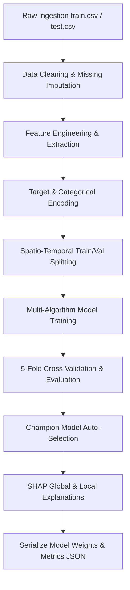

# Machine Learning Design Document (ML_DESIGN.md)
## Project: Enterprise AI Traffic Demand Prediction System

### Document Control
* **Version**: 1.0.0
* **Date**: June 2, 2026
* **Status**: Approved

---

## 1. Machine Learning Pipeline Architecture

The ML pipeline is designed to ingest raw spatial-temporal traffic logs, execute robust feature engineering, train multiple algorithms using Group K-Fold cross validation, select the highest-scoring model, and explain predictions using SHAP (SHapley Additive exPlanations).



---

## 2. Feature Engineering & Preprocessing

Based on the actual dataset analysis, we implement the following transformations:

### 2.1 Missing Value Imputation
* **RoadType (600 missing in Train, 324 in Test)**: Imputed using the **Mode per Geohash**. If a geohash is completely new, fall back to the global mode (`Residential`).
* **Temperature (2495 missing in Train, 1349 in Test)**: Imputed using **Forward Fill / Backward Fill** sorted chronologically by day and timestamp within each geohash, representing temporal continuity. If still missing, imputed using the median hourly temperature.
* **Weather (797 missing in Train, 431 in Test)**: Imputed using the mode of the same timestamp interval across other geohashes, or the global mode (`Sunny`).

### 2.2 Feature Extraction
* **Spatial Coordinates**: Decoded from the 6-character `geohash` string using the standard Base32 geohash decoding algorithm, producing:
  * `latitude` (Float)
  * `longitude` (Float)
* **Temporal Components**: Derived from `timestamp` ("H:M") and `day` (Integer):
  * `hour`: Extract the hour index (0 to 23).
  * `minute`: Extract the minute index (0, 15, 30, 45).
  * `minute_of_day`: Combined time representation: $\text{hour} \times 60 + \text{minute}$ (0 to 1425).
  * `sin_time` / `cos_time`: Cyclical sine/cosine transformation of `minute_of_day` to reflect that 23:45 is chronologically adjacent to 0:00.
    $$\text{sin\_time} = \sin\left(\frac{2\pi \times \text{minute\_of\_day}}{1440}\right)$$
    $$\text{cos\_time} = \cos\left(\frac{2\pi \times \text{minute\_of\_day}}{1440}\right)$$
* **Traffic Lag & Aggregation Features**:
  * Since we must forecast up to 11.5 hours ahead on Day 49, lag features are built using historical averages.
  * `geohash_mean_demand`: Historical average demand for each location.
  * `geohash_hourly_mean`: Average demand for a specific location at a specific hour of the day.

### 2.3 Encoding & Scaling
* **Categorical Encoding**:
  * `LargeVehicles` (Allowed, Not Allowed) -> Binary Encoded (1, 0).
  * `Landmarks` (Yes, No) -> Binary Encoded (1, 0).
  * `RoadType` (Highway, Street, Residential) -> One-Hot Encoded.
  * `Weather` (Sunny, Rainy, Foggy, Snowy) -> One-Hot Encoded.
* **Feature Selection**: Drop high-cardinality strings like `geohash` and identifiers like `Index` before feeding the array into model layers.

---

## 3. Validation Strategy

To prevent leakage and ensure spatial generalizability, we employ a **Group K-Fold Cross-Validation (K=5)** where the group is defined by `geohash`.
* This ensures that validation sets contain geohashes that the model was NOT trained on in that fold.
* This simulates the real-world deployment scenario where the system must predict traffic demand for geographical areas with sparse or newly added historical telemetry.

### Metrics of Evaluation
Each fold is evaluated using:
1. **R² Score (Coefficient of Determination)**: Measures the proportion of variance explained by the features. Target: $> 0.85$.
2. **Mean Absolute Error (MAE)**: Average magnitude of prediction errors.
3. **Root Mean Squared Error (RMSE)**: Penalizes larger errors, useful for high-traffic gridlock predictions.

---

## 4. Model Architectures & Tuning

We train and compare five model classes using identical cross-validation splits:

1. **Linear Regression (Baseline)**: ElasticNet regularization to establish linear limits.
2. **Random Forest**: Standard bagging tree ensemble to capture non-linear feature interactions.
3. **XGBoost**: Extreme Gradient Boosting with depth-wise tree growth.
4. **LightGBM**: Highly efficient histogram-based gradient boosting optimized for leaf-wise growth.
5. **CatBoost**: Optimized gradient boosting that natively handles categorical representations and prevents target leakage.

### Hyperparameter Search Spaces

```python
# Hyperparameters for AutoML search
lgbm_params = {
    'n_estimators': [100, 300, 500],
    'learning_rate': [0.01, 0.05, 0.1],
    'num_leaves': [31, 63, 127],
    'subsample': [0.8, 1.0]
}

xgboost_params = {
    'n_estimators': [100, 300, 500],
    'learning_rate': [0.01, 0.05, 0.1],
    'max_depth': [6, 8, 10],
    'subsample': [0.8, 1.0]
}
```

---

## 5. Explainability (SHAP Integration)

To address the black-box nature of boosting models, the pipeline integrates SHAP:
* **Global Interpretability**: Generates a SHAP Beeswarm summary plot to visualize feature contributions across the entire training corpus.
* **Local Interpretability**: Uses SHAP Force/Waterfall plots for individual predictions. For example: "Predicting demand = 0.82 for geohash `qp02z1` because it is a Highway (+0.35) and NumberofLanes is 4 (+0.12), offsetting the cool Temperature of 12°C (-0.02)."
* **Performance Optimization**: Background tree-based explainer models are pre-calculated on a downsampled subset of the training data (e.g., 1000 representative records) to keep prediction API responses fast.
