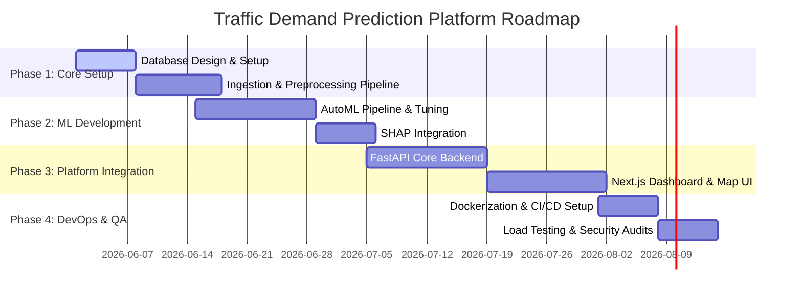

# Product Requirements Document (PRD)
## Project: Enterprise AI Traffic Demand Prediction System

### Document Control
* **Version**: 1.0.0
* **Date**: June 2, 2026
* **Status**: Draft

---

## 1. Product Vision & Problem Statement

### 1.1 Product Vision
To be the definitive spatial-temporal predictive intelligence platform for urban transit optimization. The platform transforms raw traffic data into highly accurate demand forecasts, giving private fleets and municipal organizations the foresight to eliminate congestion, minimize emission waste, and optimize scheduling.

### 1.2 Problem Statement
Urban traffic patterns are highly volatile and influenced by complex geographical layouts, time variables, and shifting weather conditions. Existing traffic prediction solutions are either too coarse (city-wide instead of localized geohashes) or lack modern, explainable machine learning interfaces. There is a critical need for an integrated tool that handles raw historical logs, automates pipeline execution, offers local and global explainability, and hosts an API for external consumption.

---

## 2. User Personas

1. **Marcus (Fleet Dispatch Manager)**: Manages a fleet of 500 ride-sharing vehicles. Needs to ensure vehicles are pre-positioned in high-demand locations before traffic peaks.
2. **Sarah (Lead Data Scientist)**: Wants to import new traffic datasets, build pipelines, train models, compare algorithms, and inspect feature importances (SHAP) to improve accuracy.
3. **David (Traffic Management Coordinator)**: Works for the Municipal Transportation Commission. Uses predictions to adjust dynamic traffic signals and inform city planners of bottlenecks.

---

## 3. User Stories (Exactly 30)

### 3.1 Dataset Management & Analysis
1. **US-01**: As an Analyst, I want to upload traffic CSV datasets so that I can ingest training and test data into the system.
2. **US-02**: As a Data Scientist, I want to view a summary of missing values in the dataset so that I can decide on an imputation strategy.
3. **US-03**: As a Data Scientist, I want to see the distribution of Road Types so that I can understand the sample balance.
4. **US-04**: As a Data Scientist, I want to see a correlation matrix between numeric features and the target variable.
5. **US-05**: As an Analyst, I want to view descriptive statistics (mean, min, max, std) of the target variable `demand`.
6. **US-06**: As a User, I want to view temperature variations mapped against time intervals to identify thermal correlations.
7. **US-07**: As a Developer, I want an endpoint to retrieve the schema of ingested datasets automatically.
8. **US-08**: As an Analyst, I want to see spatial overlap statistics between training and test geohashes to ensure spatial consistency.

### 3.2 Feature Engineering & Model Training
9. **US-09**: As a Data Scientist, I want to extract temporal features (hour, minute, minute of day) from timestamps.
10. **US-10**: As a Data Scientist, I want the system to decode geohashes into latitude and longitude coordinates.
11. **US-11**: As a Data Scientist, I want to apply target-encoding to the `geohash` feature using historical demand means.
12. **US-12**: As a Data Scientist, I want to impute missing `RoadType` values using the mode of the same geohash location.
13. **US-13**: As a Data Scientist, I want to train multiple model architectures (Linear, RF, XGB, LGBM, CatBoost) in a single workflow.
14. **US-14**: As a Data Scientist, I want to evaluate models using a 5-fold cross-validation scheme to prevent overfitting.
15. **US-15**: As a Lead Data Scientist, I want the training pipeline to automatically flag and select the model with the highest $R^2$ score.
16. **US-16**: As a Data Scientist, I want to log hyperparameter trials during training to review optimal parameter search spaces.

### 3.3 Evaluation & Explainability (XAI)
17. **US-17**: As a Lead Data Scientist, I want to generate a model comparison report (table of $R^2$, MAE, RMSE) in the UI.
18. **US-18**: As a User, I want to view a SHAP global summary plot for the selected model to understand top drivers of traffic demand.
19. **US-19**: As a User, I want to click on a specific geohash and view a SHAP local explanation to know why a demand prediction is high or low.
20. **US-20**: As an Auditor, I want to track which models were trained, when they were trained, and by whom.

### 3.4 Predictions & API Integrations
21. **US-21**: As an External Developer, I want to call a REST API to retrieve the traffic demand forecast for a set of geohashes.
22. **US-22**: As a Dispatcher, I want to export demand predictions as a CSV file to import them into my routing software.
23. **US-23**: As a Developer, I want to get the prediction results sorted by demand strength to identify top traffic hotspots.

### 3.5 Security, Administration, and Logs
24. **US-24**: As an Administrator, I want to manage system users and assign roles (Data Scientist, Analyst, Admin, Viewer).
25. **US-25**: As a Security Officer, I want to view audit logs showing all prediction requests and dataset uploads.
26. **US-26**: As a User, I want to log in securely with JWT token authentication.
27. **US-27**: As an Admin, I want to toggle maintenance mode for the model training pipeline.

### 3.6 Analytics Dashboard & UI
28. **US-28**: As a Dispatcher, I want to view a map overlay showing high-demand areas in dark orange and low-demand in yellow.
29. **US-29**: As a Dispatcher, I want to filter predictions by specific times (e.g. 8:30 AM, 12:00 PM) to see shift-specific patterns.
30. **US-30**: As a User, I want the web interface to toggle between Dark Mode and Light Mode to reduce eye strain.

---

## 4. Functional Requirements

### 4.1 Dataset Ingestion and Profiling Module
* **FR-1**: System must support upload of CSV files containing columns: `geohash`, `day`, `timestamp`, `demand` (optional for test), `RoadType`, `NumberofLanes`, `LargeVehicles`, `Landmarks`, `Temperature`, and `Weather`.
* **FR-2**: System must generate a data profile JSON payload containing dimensions, null counts, distinct counts, and categorical distributions.

### 4.2 Automated Machine Learning Pipeline (AutoML)
* **FR-3**: Pipeline must perform missing data imputation: mode for categorical (`RoadType`, `Weather`), mean/median for numerical (`Temperature`).
* **FR-4**: Pipeline must decode geohashes to latitude/longitude coordinates and compute distance features.
* **FR-5**: Pipeline must train 5 models: Linear Regression, Random Forest, XGBoost, LightGBM, CatBoost.
* **FR-6**: Model selection must be automated based on highest Out-Of-Fold $R^2$ score.

### 4.3 Explainability Module
* **FR-7**: SHAP explainer must be initialized for tree-based models and output feature attributions.

### 4.4 Dashboards and Visualization
* **FR-8**: Map visualization displaying geohashes color-coded by traffic demand.
* **FR-9**: Chart dashboards showing prediction error, temporal trends, and feature correlations.

---

## 5. Non-Functional Requirements

* **Scalability**: Backend must scale horizontally to handle up to 10 instances.
* **Accuracy**: Model $R^2$ must exceed 0.85 on test folds.
* **Availability**: 99.9% uptime for core prediction endpoints.
* **Security**: API endpoints protected by JWT tokens. Role-based access control (RBAC) enforced on model training.
* **Portability**: All services (frontend, backend, database, ML runner) must run in Docker containers.

---

## 6. Product Roadmap & Release Plan

### 6.1 Release Plan (MVP to v1.0)
* **Release 0.1.0 (Alpha)**: Core ML pipeline and CLI script. Ingests raw CSV and exports a submission file.
* **Release 0.5.0 (Beta)**: FastAPI backend and PostgreSQL database integration. Ingestion, Training, and Prediction APIs functional.
* **Release 1.0.0 (Production)**: Next.js Frontend Dashboard integrated with FastAPI. Map overlay and interactive SHAP analysis fully functional. Dockerized deployment.
