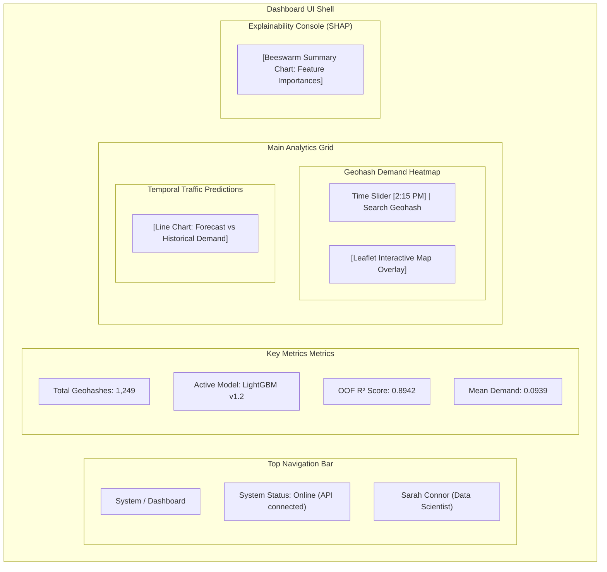
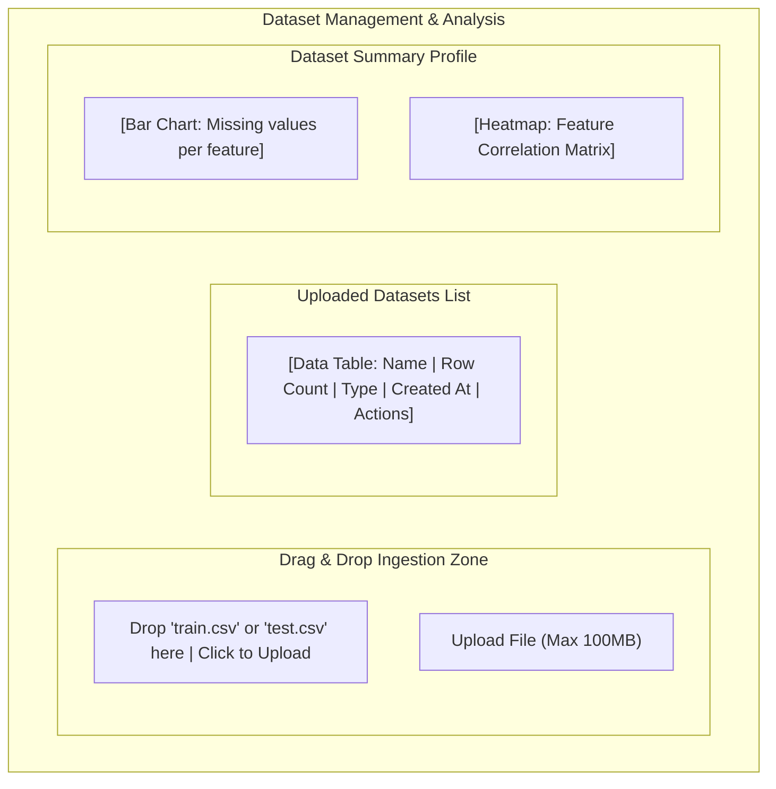
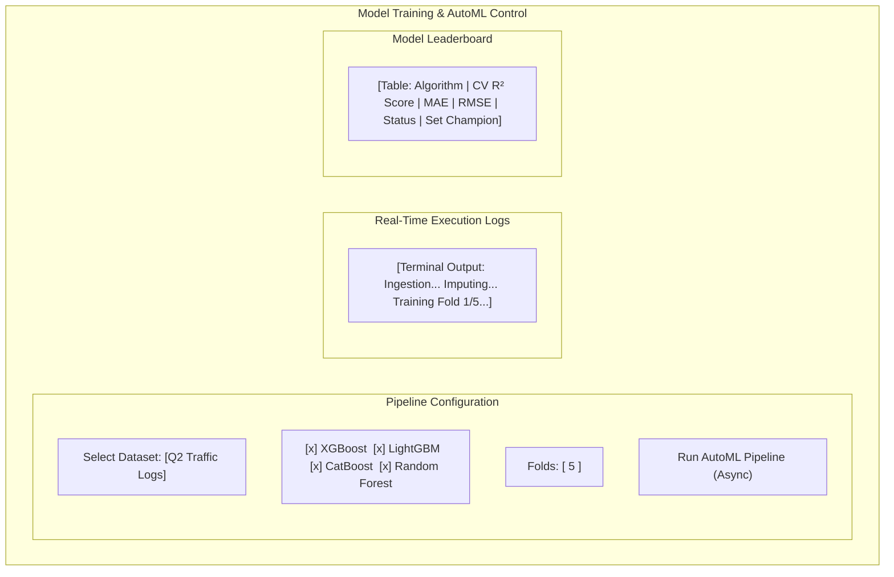
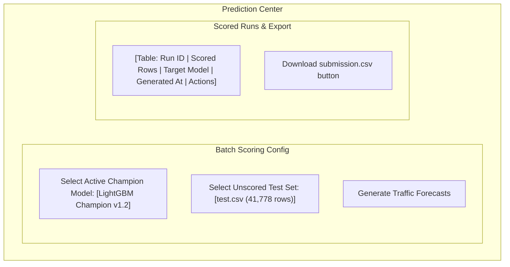

# UI/UX Design Specification Document (UI_UX.md)
## Project: Enterprise AI Traffic Demand Prediction System

### Document Control
* **Version**: 1.0.0
* **Date**: June 2, 2026
* **Status**: Approved

---

## 1. Design System & Aesthetics

The system is styled with a premium, modern dashboard theme incorporating glassmorphism, responsive grid systems, and subtle transitions:

* **Primary Palette**: Deep Space Black background (`#0b0f19`), Sleek Slate Card background (`rgba(17, 25, 40, 0.75)` with backdrop filter blur of `12px`), Electric Cyan primary accent (`#06b6d4`), and Alert Amber for warning states.
* **Typography**: Primary typeface is **Outfit** or **Inter** (sans-serif) imported from Google Fonts, utilizing tracking/letter-spacing modifiers for high readability.
* **Animations**: All hover interactions use smooth easing (`cubic-bezier(0.4, 0, 0.2, 1)`) and micro-scaling (e.g. `scale(1.02)`) on cards.

---

## 2. Global Layout Structure

The layout features a persistent Sidebar Navigation combined with a top-bar Breadcrumb/User control panel and a fluid content workspace.

```
+-----------------------------------------------------------------+
| Sidebar    | Top Header: Breadcrumbs | System Status | User Icon|
|            +----------------------------------------------------+
| * Dash     |                                                    |
| * Data     |               Main Content Workspace               |
| * Train    |                                                    |
| * Predict  |               - Responsive Grid Cards              |
| * Analyze  |               - Charts & Tables                    |
| * Reports  |               - Maps                               |
| * Settings |                                                    |
+------------+----------------------------------------------------+
```

---

## 3. Wireframes (Mermaid Format)

### 3.1 Main Analytics Dashboard Wireframe



### 3.2 Dataset Analysis Page Wireframe



### 3.3 Model Training & Leaderboard Wireframe



### 3.4 Prediction Center Wireframe



---

## 4. Responsive & Interactive Behavior

* **Mobile Breakpoints**: Standard Tailwind screen modifiers are applied (`sm`, `md`, `lg`, `xl`). On screens smaller than `1024px`, the Sidebar collapses into a Hamburguer floating drawer menu, and the two-column grid stacks vertically.
* **Loading States**: Dynamic skeleton loader cards (using a glowing animation pulse) are rendered while fetch requests are in progress.
* **Interactive Tooltips**: Hovering over Map geohashes reveals coordinates, street type, and exact forecasted demand. Clicking a geohash dynamically loads the SHAP local waterfall plot.
